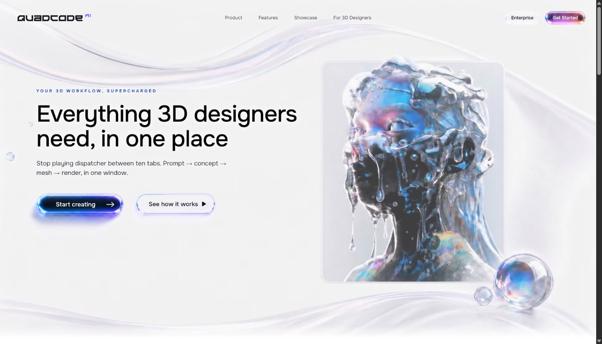

# Quadcode AI — landing page for freelance 3D generalists

Test-task landing for **Quadcode AI**, aimed at a specific niche: freelance 3D
generalists (Upwork-style) who lose hours dispatching between Midjourney,
Blender and a separate render pass. Value prop: *prompt → concept → mesh →
render, in one window.*

[Live deployment](https://155.212.130.99/)



## Stack

- Vite + React 19 + TypeScript
- No CSS framework — plain CSS with custom properties, `clamp()` for fluid
  type, CSS container queries, and real `@media` breakpoints (mobile ≤ 840px)
- Only React and ReactDOM as runtime dependencies (~72 KB gzip total JS+CSS
  in the current production build)

## Structure

```
src/
  components/   Hero, Pipeline, Features, Showcase (turntable), UseCase,
                CtaSection, Footer, LegalModal
  hooks/        useHeroVideoLoop (video crossfade), useTurntable
                (native video drag-to-rotate), useReveal
                (scroll-in animation)
public/assets/  video, fonts, compressed images
```

## Scripts

```bash
npm install
npm run dev        # local dev server
npm run build       # production build -> dist/
npm run preview     # serve the production build locally
```

## Performance work

The two heavy pieces are the hero background loop and the UFO turntable —
both re-encoded from the original masters with `ffmpeg`:

| Asset | Before | After | How |
|---|---|---|---|
| `hero-background.mp4` | 8.0 MB (1920×1080, ~6.6 Mbps) | 5.8 MB (H.264 High, CRF 17, ~4.8 Mbps) | Original 24 fps and 1920×1080 frame retained; faststart |
| `hero-mobile.mp4` | 8.0 MB full-frame master | 2.0 MB (500×1080, H.264 High, CRF 17) | Portrait crop matching the source's 62% mobile framing; original 24 fps, no scaling or dropped frames, faststart |
| `turntable.mp4` | 8.4 MB (1756×1180, ~17 Mbps) | 6.1 MB (1280×860, H.264 High, CRF 17) | Re-encoded directly from the master; original 24 fps and all 97 frames retained; every frame is a keyframe for consistent native scrubbing; faststart |
| Buttons | 472 KB source PNGs | 318 KB total (4 WebP files, alpha kept) | WebP export; the Start asset is shared by desktop and mobile |
| Pipeline/use-case photos | — | 320 KB total (WebP) | exported directly as WebP |

On desktop, the hero serves one high-quality H.264 MP4 and crossfades between
two `<video>` elements sharing the same cached source, so the clip never shows
a hard cut. On
mobile it serves a dedicated H.264 video cropped directly from the 6.6 Mbps
master: the visible pixels retain their native scale and all 24 frames per
second, while off-screen sides are not downloaded. The interactive UFO uses
a single all-intra-frame H.264 MP4 through the browser's hardware video decoder
on desktop and mobile. Dragging seeks all 97 native frames instead of retaining
a large array of decoded canvas frames. The virtual position pauses while the
browser is decoding, preventing slower mobile devices from skipping farther
between displayed frames than desktop. Loading is triggered by an
`IntersectionObserver` with a 1600px runway, leaving the poster in place until
the media is ready. Both viewport sizes use the same sway amplitude, speed,
easing and mirrored end behavior. The versioned video URL prevents a previously
cached encode from being reused after deploy.

Total `dist/` is ~15.3 MB, of which ~15.1 MB is media/font assets and only
~72 KB gzip is JS+CSS — the app shell itself is not the bottleneck; the motion
assets are, and that's expected/acceptable per the brief ("видео может
снижать [Lighthouse], это ок").

Further, if needed: serve the videos from behind a CDN with range-request
support. The MP4 files are `faststart`-muxed, so byte-range delivery already
works without one.

## Lighthouse — production deployment

Measured against the live HTTPS deployment on 18 July 2026 with Lighthouse
13.4.0 and its simulated mobile/desktop throttling profiles:

| Profile | Performance | Accessibility | Best Practices | SEO | FCP | LCP | TBT | CLS |
|---|---:|---:|---:|---:|---:|---:|---:|---:|
| Mobile | **75** | 95 | 100 | 92 | 3.9 s | 4.3 s | 0 ms | 0.063 |
| Desktop | **81** | 93 | 100 | 92 | 1.4 s | 2.2 s | 0 ms | 0.001 |

The task's Lighthouse Performance requirement (`> 70`) is met on both
profiles. These are production-server lab results rather than local-dev
measurements; scores may vary slightly between runs.

## Deployment

The production build is served by nginx at
[https://155.212.130.99/](https://155.212.130.99/). HTTP redirects to HTTPS;
the IP endpoint uses a publicly trusted, automatically renewed Let's Encrypt
certificate.

To deploy another copy, use one of these options:

Three options, pick what fits your box:

**1. Docker (simplest, no Node/nginx setup needed on the host)**
```bash
docker build -t quadcode-hero .
docker run -d -p 80:80 --name quadcode-hero quadcode-hero
```

**2. Plain nginx (no Docker)**
```bash
npm run build
rsync -avz --delete dist/ user@your-server:/var/www/quadcode-hero/
# then point an nginx server block's `root` at that path — nginx.conf in
# this repo has the gzip + cache-control rules to copy into your site config
```

**3. Any static file host** (the `dist/` folder is fully static — no server-side
code, no environment variables) — copy it wherever you already serve static
files from.

## Asset brief

All generated assets were created through Higgsfield. The table names the
underlying generation model separately so the workflow stays reproducible.

| Asset | Platform · model | Prompt (short) | Iterations | Post-processing |
|---|---|---|---:|---|
| Asya Kim avatar | Higgsfield · GPT Image 2 | Realistic portrait of Asya Kim, a freelance 3D generalist focused on product visualization and presented as Upwork Top Rated; no text, logos or lettering | 1 | Circular crop, downscaled to 112×112, WebP export |
| Wireless headphones | Higgsfield · GPT Image 2 | Use the supplied product photo as a loose reference; create a different wireless headphone design on a clean white background | 1 | White-background product crop, WebP export |
| Hero concept still | Higgsfield · GPT Image 2 | Rework three visual references into a Quadcode AI landing hero for professional 3D designers; English copy, Quadcode AI branding and a light neutral palette | 6 | Selected composition integrated into the live layout; exported as a 1280×720 JPEG poster |
| Hero animation | Higgsfield · Seedance 2 | Static premium SaaS hero; animate only the 3D character creation process, glass ribbons and subtle particles; seamless 10-second loop | 3 | H.264 MP4 encode; dual-video crossfade hides the residual source seam |
| UFO still | Higgsfield · GPT Image 2 | Generate an original iridescent UFO from the supplied references, using the reference palette and liquid-glass drips; NFT-art finish, no UI or text | 2 | Cropped and exported as the 1280×860 turntable poster |
| UFO turntable video | Higgsfield · Kling 3.0 Turbo | Camera completes one constant-speed 360° orbit around a centered static UFO and returns to the exact starting angle; background unchanged | 2 | Re-encoded from the 1756×1180 master as 1280×860 all-I H.264; all 97 frames retained for native desktop/mobile scrubbing; lazy-loaded and cache-busted |
| Pipeline 01 — Concept | Higgsfield · GPT Image 2 | Ancient stone golem with mossy runes, painterly concept sketch, rough brushstrokes, white background | 1 | WebP export |
| Pipeline 02 — Mesh | Higgsfield · GPT Image 2 | Same golem as a grey clay 3D viewport render with wireframe overlay, matcap shading and a neutral studio | 1 | Previous stage used as visual reference; WebP export |
| Pipeline 03 — Materials | Higgsfield · GPT Image 2 | Same golem as a clean PBR look-dev presentation with stone, moss and metal material spheres | 1 | Previous stage used as visual reference; UI/text excluded with a negative prompt; WebP export |
| Pipeline 04 — Final render | Higgsfield · GPT Image 2 | Same golem as an 8K cinematic final render with key light, volumetric fog, color grading and an Octane-style finish | 1 | Previous stage used as visual reference; WebP export |
